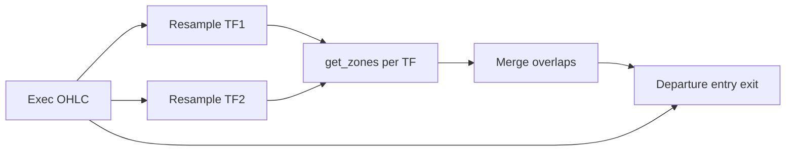

# S/D Zone Strategy — obchodní specifikace (`sd_zone_strategy`)

Tento dokument popisuje **chování strategie** v [`strategies/sd_zone_strategy/main.py`](strategies/sd_zone_strategy/main.py). Geometrická pravidla zón (BOS, šířka, invalidace) jsou v [`SD_def.md`](SD_def.md) a v referenčním modulu [`examples/sd_zones.py`](examples/sd_zones.py) (kopie v aplikaci jako `S_D_Zones`).

---

## 1. Účel a závislosti

- **Cíl:** Obchodovat návraty do Supply/Demand zón vymezených modulem `get_zones`, s exekucí na **jemném** timeframe dat instrumentu (např. 30m) a detekcí zón na **hrubším** timeframe (např. 1D), případně na více TF najednou (MTF merge).
- **Moduly:** **`get_zones`** (S/D zóny, např. `S_D_Zones` / `SD_identificator`) je **povinný** — ve UI vybrat a **Potvrdit**. Modul swingu (`Swing_HL` / `HL_identificator`) je **povinný jen při zapnutém filtru trendu** (`trend_filter_enabled`), protože strategie volá `get_trend` z téhož zdroje jako referenční view.

---

## 2. Datový tok

**View (preview grafu):** u instrumentu s jemnými daty (např. 30m) modul v parametrech používá **`timeframe`** = TF struktury (např. `1d`) a **`data_timeframe`** = TF souboru; Swing HL před výpočtem agreguje OHLC na `timeframe`. Strategie tento split nemusí řešit ve View — resampling zón řeší `_resample_to_zone_tf` / `zone_timeframes`.

1. Z Backtrader datové řady se sestaví `exec_df` (OHLC, časová indexace).
2. Pro každý řetězec v `zone_timeframes` (viz níže) se `exec_df` **resampluje** na daný TF (pandas `resample`, `label=left`, `closed=left`).
3. Na každém takovém OHLC se zavolá `get_zones(ohlc, module_params)` — parametry modulu se slučují s `_sd_module_params_for_tf(tf)` (včetně `timeframe` / `data_timeframe` = daný TF a `zone_extend_right_bars` = `zone_max_bars` ze strategie).
4. Obchodní logika (odchod zóny, vstup limit/market, stop, barové TP/SL) běží na **každém exekučním baru** (nativní data instrumentu).

---

## 3. MTF slučování zón

- Parametr **`zone_timeframes`:** řetězec oddělený čárkami, např. `"1d"` nebo `"1w,1d,4h"`. Pokud je prázdný, použije se **`zone_timeframe`** (zpětná kompatibilita) jako jediný TF.
- Ze všech TF se vezmou pouze zóny `Demand` / `Supply`, které jsou **v okně** modulu: `start_idx <= d_idx <= end_idx` kde `d_idx = len(ohlc_tf) - 1`.
- Zóny **stejného typu** (oba Demand nebo oba Supply), jejichž cenové rozsahy mají vzájemný poměr průniku k menší výšce zóny ≥ **`zone_price_overlap_threshold`**, spadají do jednoho **clusteru**.
- Z každého clusteru se vybere **reprezentant**:
  - **`prefer_higher_tf: true`** (výchozí) — zóna z **nehrubšího** TF (vyšší `coarseness`, např. 1W > 1D > 4h).
  - **`prefer_higher_tf: false`** — zóna z **nejemnějšího** TF v clusteru.
- Sledování v strategii používá klíč založený na jménu, `primary_tf`, seřazeném seznamu TF v clusteru a cenových hranicích — viz `_merged_zone_key`.

---

## 4. Stavový automat na zónu

Každá sledovaná zóna (po sloučení) má stav v `_zone_track`:

| Stav | Význam |
|------|--------|
| `watch_departure` | Čeká se **opuštění** zóny na exekučním baru: Demand — `bar_low > zone_high`; Supply — `bar_high < zone_low`. Po opuštění se **jednou** nastaví vstupní větev (`armed`). |
| `wait_momentum` | Pouze u **`entry_style = market_momentum`**: po odchodu čekání na signálový bar; timeout **`momentum_max_wait_bars`** → smazání tracku. |
| `pending_limit` | Čeká na fill **limitní** objednávky. |
| `pending_market` | Čeká na fill **market** objednávky (momentum vstup). |

Ukončení sledování:

- **Invalidace** podle **close posledního baru** na **`primary_tf`** resamplu: Demand pokud `close < value_low`; Supply pokud `close > value_high`.
- **Timeout čekající vstupní objednávky:** `max_limit_bars_exec` exekučních barů od `armed_exec_bar` → zrušení objednávky a smazání tracku (platí pro limit i market pending).
- **Vyplnění vstupu** → záznam se z tracku maže (pozice řeší `notify_order`).
- **Zrušení / margin / reject** objednávky → návrat do `watch_departure`, reset `departed` / `armed` a čítačů dip/momentum.

---

## 5. Vstup (`entry_style`, limit, momentum)

- **`entry_style`:** `limit_edge` \| `limit_mid` \| `market_momentum`. Prázdná / neznámá hodnota se odvodí z `entry_mode` (`mid` → `limit_mid`, jinak `limit_edge`).
- **Limit** (`limit_edge` / `limit_mid`): cena z **`entry_mode`** + **`entry_pct`** stejně jako dříve:
  - **`edge`** — Demand: **`value_high`**; Supply: **`value_low`**.
  - **`mid`** — střed zóny.
  - **`pct`** — interpolace mezi `value_low` a `value_high` podle `entry_pct` (0–1).
- **Momentum** (`market_momentum`): po odchodu stav `wait_momentum`; na každém baru se aktualizuje **dip** (nejnižší low / nejvyšší high od odchodu). Signál:
  - **Demand:** pokud `momentum_require_bull_bar`, musí být `close > open`; pokud `momentum_close_above_zone_high`, musí být `close > value_high`. Pak **market buy** za `close`.
  - **Supply:** obdobně **bear** bar (`close < open`) a volitelně `close < value_low`. Pak **market sell** za `close`.
- **Stop** je **mimo zónu**: vzdálenost **`stop_offset_pct * height`** od protilehlé hrany (`height = value_high - value_low`). Chybí-li `stop_offset_pct` v parametrech, strategie použije součet legacy `stop_width_extra_pct` + `stop_buffer_pct`.

---

## 6. Take profit

**Cíl** je vždy **`entry ± risk * target_rr`**, kde `risk = |entry - stop|` ve směru obchodu (long: `entry - stop`, short: `stop - entry`).

**Exit:** na exekučním baru se pozice zavře, pokud high/low zasáhne TP nebo SL (barová simulace, ne samostatný limit TP).

---

## 7. Filtry zóny (před zařazením do tracku)

V UI panelu **Parametry strategie** je jen zúžený `PARAMS`; níže uvedené filtry mají výchozí hodnoty ve **`Strategy.params`** v `main.py` (úprava v kódu). Výjimka: **`trend_filter_enabled`** lze zapnout z panelu — detaily okna a prahů trendu zůstávají u defaultů ve třídě, dokud je nezměníš v kódu.

| Parametr | Výchozí | Význam |
|----------|---------|--------|
| `allow_zones_with_touch` | `True` | Pokud `False`, zóny s `has_touch` z modulu se ignorují. |
| `max_zone_age_bars` | `0` | Pokud > 0, zóna se ignoruje, pokud `d_idx - pivot_idx > max` (stáří na TF reprezentanta). `pivot_idx` exportuje modul; starší moduly bez pole použijí fallback `end_idx`. |
| `max_base_length` | `0` | Pokud > 0, obchodovat jen zóny s `base_length` ≤ této hodnoty (`base_length` počítá modul S/D). `0` = bez omezení. |
| `min_impulse_score` / `max_impulse_score` | `0` | Hodnota `0` = filtr vypnutý; jinak `impulse_score` musí být v intervalu. |
| `min_inducement_points` / `max_inducement_points` | `0` | Stejně pro `inducement_points`. |
| `require_inducement` | `0` | Ve strategii `1` = do tracku jen zóny s `inducement_count` > 0 (doplňuje filtr modulu). |

### 7.1 Filtr trendu (okno skóre u `pivot_idx`)

Volitelně (`trend_filter_enabled` = 1) strategie před zařazením do `_zone_track` vyhodnotí **trend skóre** ze stejného zdroje jako modul swingů (`get_trend` z `HL_identificator` / `Swing_HL`, případně fallback `examples.swing_hl_detector` v dev prostředí).

- **OHLC:** resample na **TF dané zóny** (`_primary_tf` u merged zóny), stejně jako u `get_zones`.
- **Index rozhodnutí:** `pivot_idx` z modulu; pokud `get_trend` uvnitř zvedne data na minimální TF trendu, index se **namapuje přes čas** (stejná logika jako v `examples/swing_hl_detector._ensure_min_tf`).
- **Okno:** posledních **`trend_window_bars`** skóre včetně baru `pivot_idx` (na začátku série se okno zkrátí).
- **Agregace `trend_window_mode`:**
  - **`minmax`** (doporučeno): **Demand** — `min(okno) ≥ trend_min_score_demand` (celé okno „dostatečně bull“); **Supply** — `max(okno) ≤ trend_max_score_supply`.
  - **`mean`:** stejné prahy na **průměr** okna.
- **Neutrální / smíšené pásmo:** okno není čistě bull pro Demand ani čistě bear v smyslu výše (např. překryv mezi `trend_max_score_supply` a `trend_min_score_demand`) — chování řídí **`range_zone_policy`**: `both` = zónu ponechat, `none` = zónu zahodit.

V modulu S/D zůstávají ve `VIEW_PARAMS` hlavně čas, base, filtry zóny a přepínače trend okna; **EMA a vyhlazení skóre** pro `get_trend` bere swing modul z vlastních `PARAMS` / výchozích hodnot. Strategie je při backtestu může doplnit přes své ploché `PARAMS` a `module_params`.

**Shoda View ↔ backtest:** pokud v aplikaci používáš referenční [`examples/sd_zones.py`](examples/sd_zones.py) s **stejnými** hodnotami `trend_*` ve `VIEW_PARAMS` jako ve strategii, výstup zón v náhledu odpoví filtrovanému seznamu. Jinak může View ukázat více zón než strategie.

### 7.2 Výpočet `base_length` v modulu S/D

Výška zóny = rozsah pivot svíčky (`value_low` … `value_high`). **Base** je souvislý úsek barů kolem pivotu (ne širší než pravý okraj zóny v modulu). Svíčka se do base započte, pokud platí **současně**:

1. **Range v zóně:** podíl průniku H–L svíčky se zónou k výšce H–L svíčky ≥ `base_bar_range_in_zone_min` (výchozí **0.40**).
2. **Tělo v zóně:** podíl průniku těla (open–close) se zónou k délce těla ≥ `base_body_in_zone_min` (výchozí **0.60**). U doji (nulové tělo) stačí splnění bodu 1.

Volitelně modul ve výstupu odfiltruje zóny bez inducementu (`require_inducement` = 1) a příliš dlouhou base (`max_base_length` > 0). Ostatní geometrie (prodlužování vlevo, dotyk, inducement okno, …) je v **konstantách** v `examples/sd_zones.py`.

Prahové podíly base a filtry výše jsou v **`VIEW_PARAMS`**; strategie je předává přes `_sd_module_params_for_tf` (shodné klíče v `PARAMS` strategie).

---

## 8. `zoneMeta` u obchodu

Při fillu vstupní objednávky strategie (přes `decorate_trade_record`) přidá do záznamu obchodu objekt **`zoneMeta`**, mimo jiné:

- `primaryTf`, `mergedTfs`, `zoneTimeframes`, `execTimeframe`
- `zoneAgeBars`, `pivotIdx`
- `baseLength`, `impulseScore`, `inducementCount`, `inducementPoints`, `hadInducement` (boolean), `hasTouch`, `hasGap`
- `entryStyle`, `entryMode`, `entryPct`, `entryLimit`, `stopPrice`, `targetPrice`, `targetRr`
- `preEntryDipPct`, `zoneHeight`, `zoneSizeBucket` (tercily z běžící historie výšek zón), `trapZone` (boolean: po odchodu cena znovu zasáhla do zóny před vstupem)

---

## 9. Ostatní parametry (stručně)

| Parametr | Role |
|----------|------|
| `target_rr` | Násobek R k cíli (§6). |
| `stop_offset_pct` | Podíl výšky zóny pro umístění stopu mimo zónu (§5). |
| `entry_style`, `momentum_max_wait_bars`, `momentum_require_bull_bar`, `momentum_close_above_zone_high` | Režim vstupu a pravidla momentum (§5). |
| `zone_max_bars` | Přemapuje se do modulu jako max. prodloužení zóny doprava. |
| `max_hold_bars` | Maximální držení pozice v exekučních barech, pak `close()`. |
| `max_limit_bars_exec` | Timeout čekající vstupní objednávky (limit i market). |
| `module_params` | Vnořené parametry z UI (záložky modulů) — sloučí se do volání `get_zones`. |
| `trend_filter_enabled`, `trend_window_bars`, `trend_window_mode`, `trend_min_score_demand`, `trend_max_score_supply`, `range_zone_policy` | Volitelný filtr trendu před trackem (§7.1). |
| `zone_price_overlap_threshold` | Práh překryvu cen při MTF clusteringu (§3). |

---

## 10. Známé limity

- **Velikost pozice** je v kódu fixní `size=1` (kontrakty / akcie dle brokera).
- **Recover po restartu** části stavu: `_recover_stop_target` hledá zónu podle ceny vstupu a režimu vstupu; spoléhá na aktuální seznam zón z MTF pipeline.
- Změna složení clusteru mezi bary může změnit `merged` klíč — prakticky vzácné; track se nemerguje zpětně na staré klíče.
- Modul musí vracet `start_idx` / `end_idx`; bez nich strategie zónu do tracku nevezme.

---

## 11. Changelog (strategie)

| Verze | Poznámka |
|-------|----------|
| v1.0 | Jeden `zone_timeframe`, vstup jen na hranici, Supply bug opakovaného armování. |
| v1.1 | Oprava Supply `armed`; `zone_timeframes` + merge; `entry_mode` / `entry_pct`; `stop_buffer_pct`; stáří a filtry; rozšířené `zoneMeta`; `pivot_idx` v referenčním modulu pro stáří. |
| v1.2 | Filtr `max_base_length`; pravidla base v modulu; později zjednodušení: base = AND (range % + tělo %), inducement okno v konstantách, `require_inducement` ve `VIEW_PARAMS`. |
| v1.3 | Filtr trendu z okna skóre u `pivot_idx` + `range_zone_policy`; `get_trend` ze swing modulu; volitelná shoda View přes `VIEW_PARAMS` v `examples/sd_zones.py`; `_source_tf` u `flat_sd` pro TP; `zone_price_overlap_threshold` ve výchozích `PARAMS`. |
| v1.4 | TP jen z `target_rr`; stop z `stop_offset_pct`; `entry_style` vč. `market_momentum`; dip / `trapZone` / velikost zóny v `zoneMeta`; `get_major_swings` u strategie již nepotřeba pro TP. |

---

*Pro úpravy strategie měň především `strategies/sd_zone_strategy/main.py` a tento soubor; definice geometrie zůstává v `SD_def.md` a v kódu modulu S/D.*
