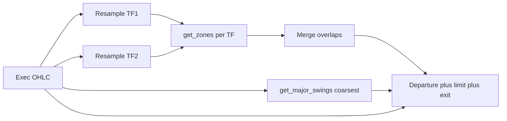

# S/D Zone Strategy — obchodní specifikace (`sd_zone_strategy`)

Tento dokument popisuje **chování strategie** v [`strategies/sd_zone_strategy/main.py`](strategies/sd_zone_strategy/main.py). Geometrická pravidla zón (BOS, šířka, invalidace) jsou v [`SD_def.md`](SD_def.md) a v referenčním modulu [`examples/sd_zones.py`](examples/sd_zones.py) (kopie v aplikaci jako `S_D_Zones`).

---

## 1. Účel a závislosti

- **Cíl:** Obchodovat návraty do Supply/Demand zón vymezených modulem `get_zones`, s exekucí na **jemném** timeframe dat instrumentu (např. 30m) a detekcí zón na **hrubším** timeframe (např. 1D), případně na více TF najednou (MTF merge).
- **Moduly (povinné):** `Swing_HL` (nebo kompatibilní `HL_identificator`) pro `get_major_swings`; `S_D_Zones` (nebo `SD_identificator`) pro `get_zones`. Ve UI je nutné oba vybrat a **Potvrdit**.

---

## 2. Datový tok

**View (preview grafu):** u instrumentu s jemnými daty (např. 30m) modul v parametrech používá **`timeframe`** = TF struktury (např. `1d`) a **`data_timeframe`** = TF souboru; Swing HL před výpočtem agreguje OHLC na `timeframe`. Strategie tento split nemusí řešit ve View — resampling zón řeší `_resample_to_zone_tf` / `zone_timeframes`.

1. Z Backtrader datové řady se sestaví `exec_df` (OHLC, časová indexace).
2. Pro každý řetězec v `zone_timeframes` (viz níže) se `exec_df` **resampluje** na daný TF (pandas `resample`, `label=left`, `closed=left`).
3. Na každém takovém OHLC se zavolá `get_zones(ohlc, module_params)` — parametry modulu se slučují s `_sd_module_params_for_tf(tf)` (včetně `timeframe` / `data_timeframe` = daný TF a `zone_extend_right_bars` = `zone_max_bars` ze strategie).
4. Pro **major swings** (sekundární TP) se použije **nejhrubší** TF z `zone_timeframes` (`_coarsest_tf`) a na něm se zavolá `get_major_swings`.
5. Obchodní logika (odchod zóny, limit, stop, barové TP/SL) běží na **každém exekučním baru** (nativní data instrumentu).

---

## 3. MTF slučování zón

- Parametr **`zone_timeframes`:** řetězec oddělený čárkami, např. `"1d"` nebo `"1w,1d,4h"`. Pokud je prázdný, použije se **`zone_timeframe`** (zpětná kompatibilita) jako jediný TF.
- Ze všech TF se vezmou pouze zóny `Demand` / `Supply`, které jsou **v okně** modulu: `start_idx <= d_idx <= end_idx` kde `d_idx = len(ohlc_tf) - 1`.
- Zóny **stejného typu** (oba Demand nebo oba Supply), jejichž cenové rozsahy mají vzájemný poměr průniku k menší výšce zóny ≥ **`zone_price_overlap_threshold`**, spadají do jednoho **clusteru**.
- Z každého clusteru se vybere **reprezentant**:
  - **`prefer_higher_tf: true`** (výchozí) — zóna z **nehrubšího** TF (vyšší `coarseness`, např. 1W > 1D > 4h).
  - **`prefer_higher_tf: false`** — zóna z **nejemnějšího** TF v clusteru.
- Sledování v strategii používá klíč založený na jménu, `primary_tf`, seřazeném seznamu TF v clusteru a cenových hranicích — viz `_merged_zone_key`.

**TP (opposing zóna):** při výpočtu cíle se do snapshotu dají **všechny** Demand/Supply zóny ze **všech** TF (`flat_sd`), ne jen reprezentanti — aby neunikl opposing level z jiného timeframe.

---

## 4. Stavový automat na zónu

Každá sledovaná zóna (po sloučení) má stav v `_zone_track`:

| Stav | Význam |
|------|--------|
| `watch_departure` | Čeká se, až cena **opustí** zónu na exekučním baru: Demand — `bar_low > zone_high`; Supply — `bar_high < zone_low`. |
| `pending_limit` | Po odchodu vystřelí se **jednou** limit (`armed` zabrání opakovanému odeslání u Demand i Supply). |

Ukončení sledování:

- **Invalidace** podle **close posledního baru** na **`primary_tf`** resamplu: Demand pokud `close < value_low`; Supply pokud `close > value_high`.
- **Timeout limitu:** `max_limit_bars_exec` exekučních barů od `armed_exec_bar` → zrušení limitu a smazání tracku.
- **Vyplnění limitu** → záznam se z tracku maže (pozice řeší `notify_order`).
- **Zrušení / margin / reject** objednávky → návrat do `watch_departure`, reset `departed` / `armed`.

---

## 5. Vstup (limit)

- **`entry_mode`** (řetězec, case-insensitive):
  - **`edge`** — Demand: limit na **`value_high`**; Supply: limit na **`value_low`** (klasická „hranice“).
  - **`mid`** — střed zóny `(value_low + value_high) / 2`.
  - **`pct`** — `value_low + (value_high - value_low) * entry_pct`, kde **`entry_pct`** je v rozsahu 0–1 (0 = spodní hrana zóny, 1 = horní).
- **Stop** je vždy **mimo zónu** ve směru rizika:
  - Demand (long): `value_low - stop_width_extra_pct * height - stop_buffer_pct * height`
  - Supply (short): `value_high + stop_width_extra_pct * height + stop_buffer_pct * height`  
  kde `height = value_high - value_low`.

---

## 6. Take profit a řazení cílů

Pořadí (stejné pro long/short se zrcadlením):

1. **Opposing zóna** — nejbližší vhodná opposing zóna musí dát R:R ≥ **`min_rr_zone`**, jinak se přeskočí.
2. **Major swing** (high pro long, low pro short) — R:R ≥ **`min_rr_swing`**.
3. **Fallback:** `entry ± risk * fallback_rr` (výchozí 2R).
4. Vždy se cíl **omezí** na max. R:R **`max_rr`** vůči skutečnému riziku (entry vs. stop).

**Exit:** na exekučním baru se pozice zavře, pokud high/low zasáhne TP nebo SL (barová simulace, ne samostatný limit TP).

---

## 7. Filtry zóny (před zařazením do tracku)

| Parametr | Výchozí | Význam |
|----------|---------|--------|
| `allow_zones_with_touch` | `True` | Pokud `False`, zóny s `has_touch` z modulu se ignorují. |
| `max_zone_age_bars` | `0` | Pokud > 0, zóna se ignoruje, pokud `d_idx - pivot_idx > max` (stáří na TF reprezentanta). `pivot_idx` exportuje modul; starší moduly bez pole použijí fallback `end_idx`. |
| `max_base_length` | `0` | Pokud > 0, obchodovat jen zóny s `base_length` ≤ této hodnoty (`base_length` počítá modul S/D). `0` = bez omezení. |
| `min_impulse_score` / `max_impulse_score` | `0` | Hodnota `0` = filtr vypnutý; jinak `impulse_score` musí být v intervalu. |
| `min_inducement_points` / `max_inducement_points` | `0` | Stejně pro `inducement_points`. |

### 7.1 Výpočet `base_length` v modulu S/D

Výška zóny = rozsah pivot svíčky (`value_low` … `value_high`). **Base** je souvislý úsek barů kolem pivotu (ne širší než pravý okraj zóny v modulu). Svíčka se do base započte, pokud platí **alespoň jedna** z podmínek:

1. **Range v zóně:** podíl průniku H–L svíčky se zónou k výšce H–L svíčky ≥ `base_bar_range_in_zone_min` (výchozí **0.40**).
2. **Pokrytí výšky zóny:** průnik H–L se zónou / výška zóny ≥ `base_zone_height_covered_min` (výchozí **0.80**) — silné překrytí zóny jednou svíčkou i při malém vlastním range.
3. **Tělo v zóně:** podíl průniku těla (open–close) se zónou k délce těla ≥ `base_body_in_zone_min` (výchozí **0.60**).

Prahové konstanty jsou v **`VIEW_PARAMS`** modulu a strategie je předává přes `_sd_module_params_for_tf` (stejné klíče v `PARAMS` strategie pro panel **Strategie**).

---

## 8. `zoneMeta` u obchodu

Při fillu limitu strategie (přes `decorate_trade_record`) přidá do záznamu obchodu objekt **`zoneMeta`**, mimo jiné:

- `primaryTf`, `mergedTfs`, `zoneTimeframes`, `execTimeframe`
- `zoneAgeBars`, `pivotIdx`
- `baseLength`, `impulseScore`, `inducementCount`, `inducementPoints`, `hasTouch`, `hasGap`
- `entryMode`, `entryPct`, `entryLimit`, `stopPrice`, `targetPrice`

---

## 9. Ostatní parametry (stručně)

| Parametr | Role |
|----------|------|
| `min_rr_zone`, `min_rr_swing`, `fallback_rr`, `max_rr` | TP logika (viz §6). |
| `zone_max_bars` | Přemapuje se do modulu jako max. prodloužení zóny doprava. |
| `max_hold_bars` | Maximální držení pozice v exekučních barech, pak `close()`. |
| `max_limit_bars_exec` | Timeout čekajícího limitu. |
| `module_params` | Vnořené parametry z UI (záložky modulů) — sloučí se do volání `get_zones`. |

---

## 10. Známé limity

- **Velikost pozice** je v kódu fixní `size=1` (kontrakty / akcie dle brokera).
- **Recover po restartu** části stavu: `_recover_stop_target` hledá zónu podle ceny vstupu a režimu vstupu; spoléhá na aktuální seznam zón z MTF pipeline.
- Změna složení clusteru mezi bary může změnit `merged` klíč — prakticky vzácné; track se nemerguje zpětně na staré klíče.
- Modul musí vracet `start_idx` / `end_idx`; bez nich strategie zónu do tracku nevezme.

---

## 11. Changelog (strategie)

| Verze | Poznámka |
|-------|----------|
| v1.0 | Jeden `zone_timeframe`, vstup jen na hranici, Supply bug opakovaného armování. |
| v1.1 | Oprava Supply `armed`; `zone_timeframes` + merge; `entry_mode` / `entry_pct`; `stop_buffer_pct`; stáří a filtry; rozšířené `zoneMeta`; `pivot_idx` v referenčním modulu pro stáří. |
| v1.2 | Filtr `max_base_length`; nová pravidla base v modulu (OR: range % / pokrytí výšky zóny / tělo %); parametry `base_*_min` ve strategii i modulu. |

---

*Pro úpravy strategie měň především `strategies/sd_zone_strategy/main.py` a tento soubor; definice geometrie zůstává v `SD_def.md` a v kódu modulu S/D.*
